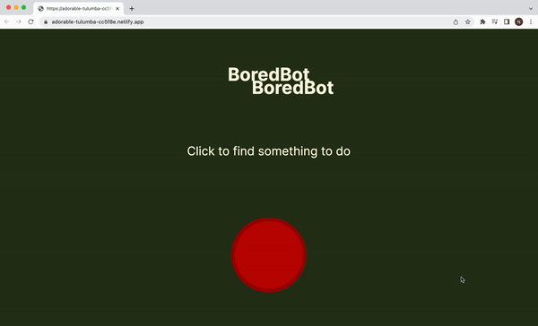

# BoredBot

BoredBot suggests a random activity

## Features
Users press the button and a new activity is rendered on their screens.

## Demo

Test it on Netlify: https://bored-bot-natalia-davtyan.netlify.app/

## Technologies
The project is built using:
* HTML
* CSS
* JavaScript
* API

## Technical details
* Used API to fetch the list of activities.

## Project status
The project is complete.

## Acknowledgements
The core of this project was built during the class on [the Frontend Developer Career Path at Scrimba](https://scrimba.com/learn/frontend) by Bob Ziroll and later edited by me.

## Contact
Created by [Natalia Davtyan](https://github.com/nataliadavtyan)
